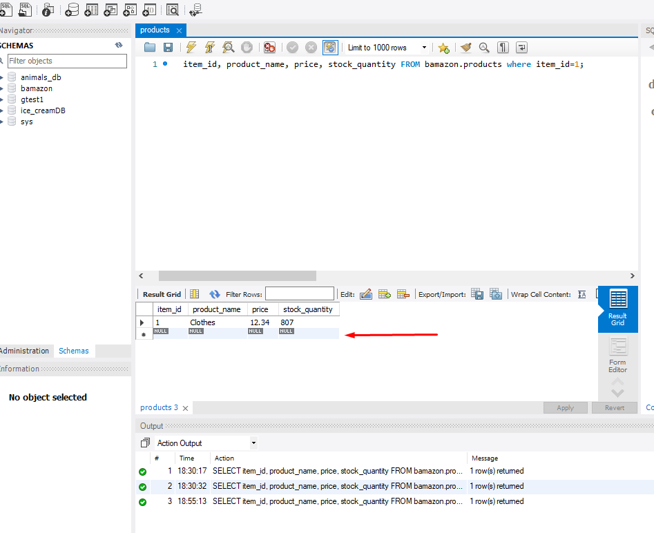
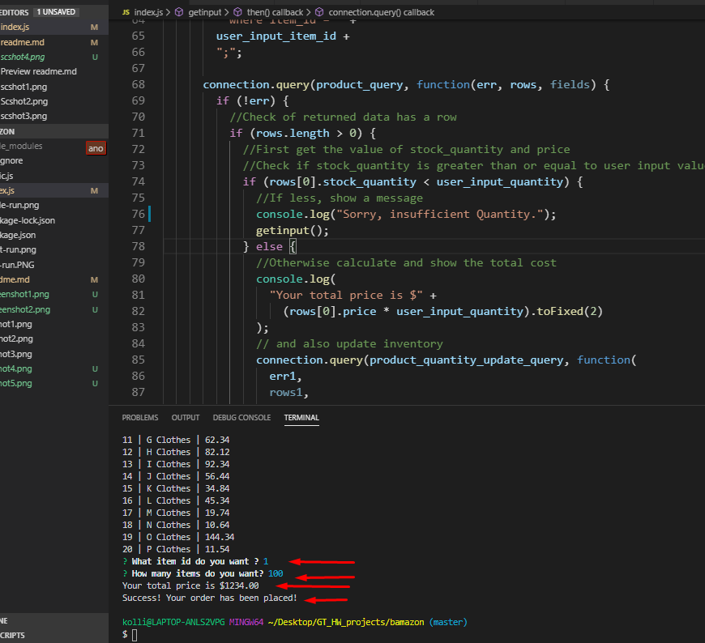
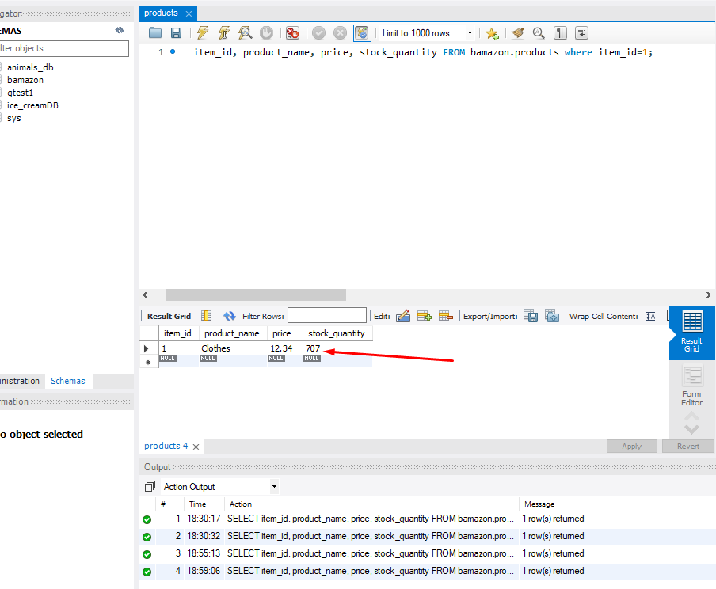

## README

#### In this app, I created a MySQL Database called **bamazon**. In this database, a table was added called **products**.

The table had the following columns :

- item_id (unique id for each product)

- product_name (Name of product)

- department_name

- price (cost to customer)

- stock_quantity (how much of the product is available in stores)

#### Mock data was used to create 10 different rows for 10 different products.

#### Index.js was then used to run the application to dispaly all the items available for sale. This will show ids, names, and prices of products for sale.

#### The app then prompts users with two messages.

- The first should ask them the ID of the product they would like to buy.
- The second message should ask how many units of the product they would like to buy.

#### Once the customer has placed the order, the application checks if the store has enough of the product to meet the customer's request.

#### If not, the app will log a phrase like `Sorry,Insufficient quantity!`, and then prevent the order from going through.

User will be prompted to pick another item id.

#### If the store does have enough of the products, the following will happen.

- The SQL database will update to reflect the remaining quantity.
- #### Once the update goes through, the customer will be shown the total cost of their purchase.

# Screenshots:

=====================================================================================================================================

### Technogies used

- MYSQL
- Node.js
- Inquirer
